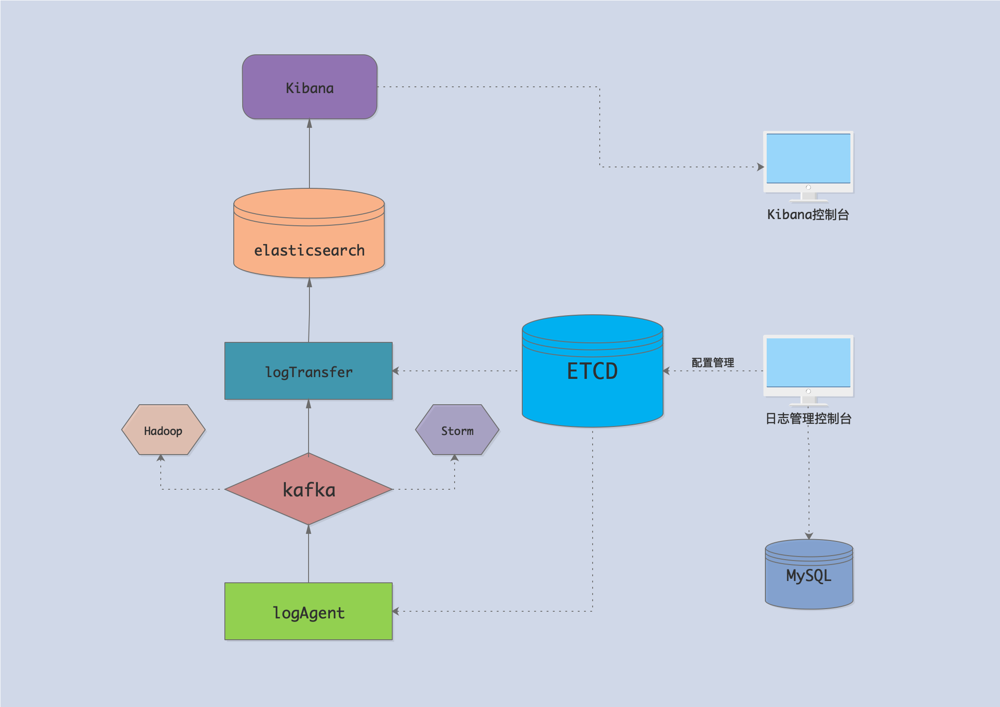
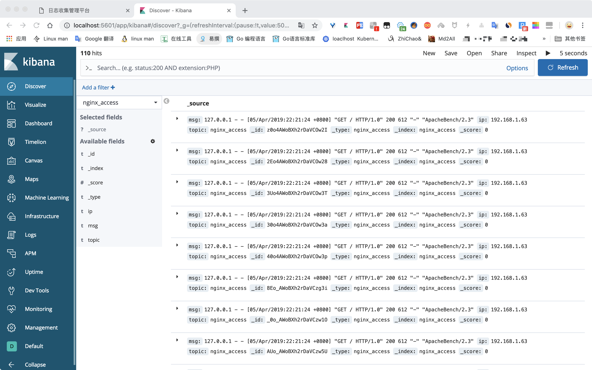
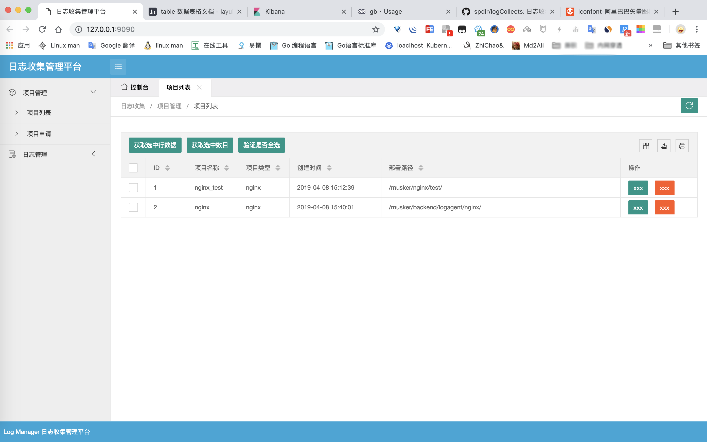
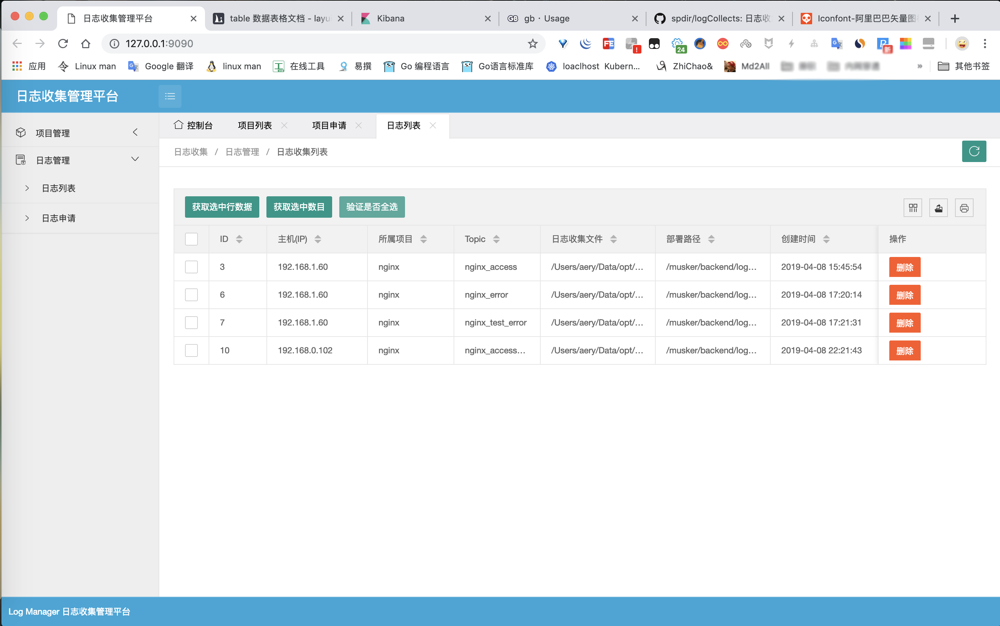

# 轻量级、动态管理日志收集客户端

> 此项目仅提供最基本的日志收集和传输的功能，提供相关解决方案思路，agent状态检测和更多功能属于内部项目暂不开源。联系方式: qq 1152490990

## 介绍
logCollect是一个轻量级，可动态管理的日志收集客户端。所有的日志收集任务都通过日志收集管理端进行配置管理。

### 架构图


### kibana截图


## 模块划分
### logAgent
日志收集模块，负责收集日志并发送到kafka。

### logTransfer
日志传输模块，负责将kafka中的消息发送到elesticsearch。

### logManager
日志收集管理端，负责项目和日志收集任务的管理。

截图:



## 技术栈
+  Go
+  ETCD
+  kafka
+  MySQL
+  elasticsearch
+  kibana
+  Beego
+  layui
+  zookeeper

## 使用

> 以下使用均在linux amd64位系统

### 1.安装依赖软件服务
1. ETCD
2. kafka
3. MySQL
4. elasticsearch
5. kibana
6. zookeeper

安装以上软件，可以为单机模式或者为集群模式

### 2. 运行logManager管理

```bash
1. $ cd logCollect-linux-amd64-${logCollectVersion}/logManager
2. 创建数据库，并将`data/logmanager.sql`文件导入到数据库中
2. 配置logManager配置文件，文件路径`conf/app.conf`
3. 启动logManager
   $ ./logmanager &> /dev/null &
```

### 4.运行logAgent日志收集客户端

```bash
1. $ cd logCollect-linux-amd64-${logCollectVersion}/logAgent
2. 配置logAgent配置文件，文件路径`config/logagent.ini`
3. 启动logAgent
   $ ./logagent config/logagent.ini &> /dev/null &
```

### 5.运行logTransfer日志传输

```bash
1. $ cd logCollect-linux-amd64-${logCollectVersion}/logTransfer
2. 配置logTransfer配置文件，文件路径`config/logagent.ini`
3. 启动logAgent
   $ ./logtransger config/logtransger.ini &> /dev/null &
```

## 编译logCollect Go程序
> 以下操作均在linux系统演示

### 1.安装go编译器
参考网上文章进行安装

### 2.编译logManager管理

```bash
$ cd /usr/local/src/logCollect-${logCollectVersion}/src/logManager
$ go build -o logmanager ./manager
```

### 3.编译logAgent日志收集客户端

```bash
$ cd /usr/local/src/logCollect-${logCollectVersion}/src/logAgent
$ go build -o logagent ./agent
```

### 4.编译logTransfer日志传输

```bash
$ cd /usr/local/src/logCollect-${logCollectVersion}/src/logTransfer
$ go build -o logtransfer ./transfer
```
